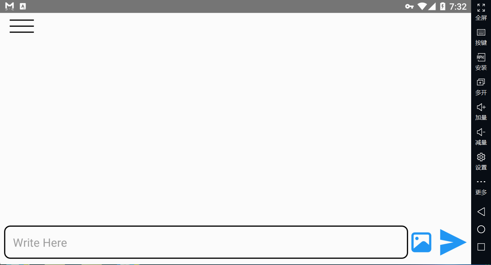
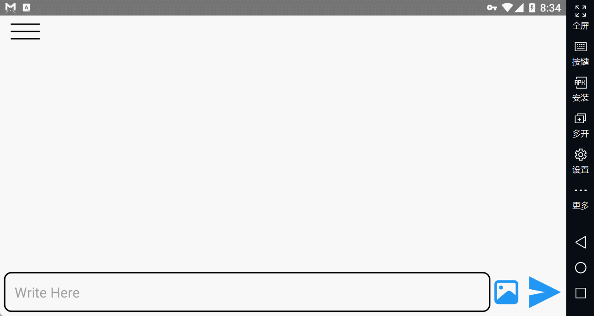
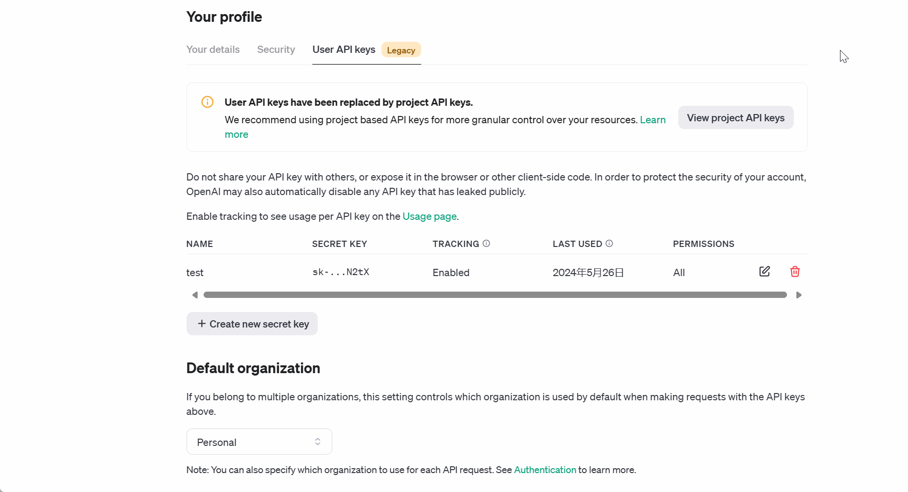
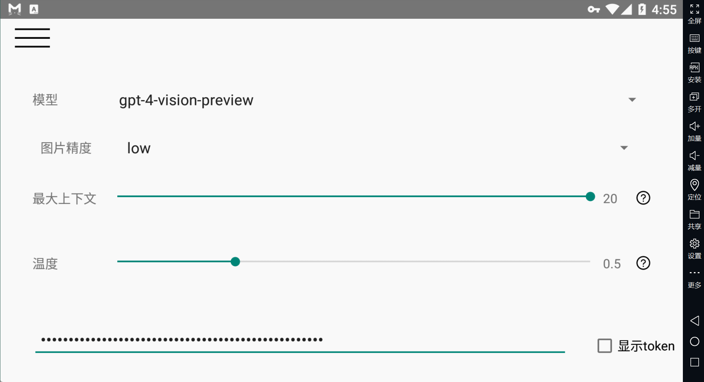

# 目录 
- [功能介绍](#功能介绍-) 
- [使用步骤](#使用步骤-) 
## 功能介绍 
### 与 ChatGPT 聊天 与 ChatGPT 进行动态对话。无论您需要帮助、想要头脑风暴想法，还是只是想进行友好的聊天，此APP都能满足您的需求。 
 
### 上传图片 
此功能允许您与 ChatGPT 分享视觉内容，使互动更加生动。 
 
### 删除聊天记录
对您的提示不满意或想清除聊天记录？轻松删除聊天记录，保持对话历史的整洁和有序。 
 
### 管理聊天记录 
高效管理您的聊天记录。跟踪您的对话并根据需要进行组织。 
 
### 设置调整参数 通过调整各种参数自定义您的体验。
根据您的偏好调整 API 设置，充分利用与 ChatGPT 的互动。 
 
## 使用步骤 
### 1. 获取 API Keys 从 OpenAI 官网获取相关的 API keys：[获取 API keys](https://platform.openai.com/settings/profile?tab=api-keys) 
### 2. 设置 API Keys 点击菜单栏中的“Setting”按钮，将 API keys（也叫 API Token，以“sk-”开头）填入此处，如下图所示： 
 
### 3. 开始聊天 在左边的菜单点击“ADD NEW CHAT”，输入相关的内容即可开始聊天。 
